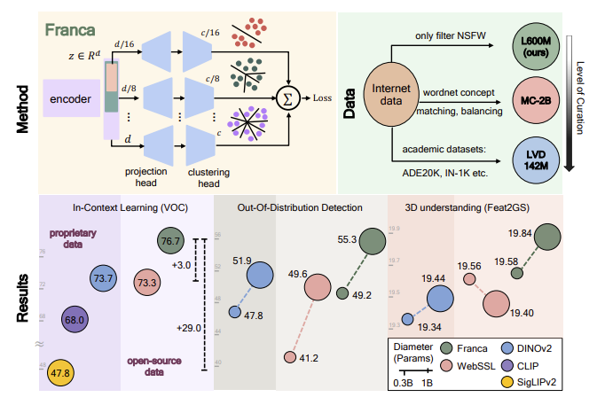

# Franca: Nested Matryoshka Clustering for Scalable Visual Representation Learning
<p align="center">
  <a href="https://arxiv.org/abs/2507.14137">
    
  </a>
  <a href="LICENSE_MODEL">
    
  </a>
  <a href="LICENSE_DATASET">
    
  </a>
  <a href="https://pytorch.org/">
    
  </a>
</p>

Shashanka Venkataramanan*,
Valentinos Pariza*,
Mohammadreza Salehi,
Lukas Knobel,
Spyros Gidaris,
Elias Ramzi,
Andrei Bursuc†,
Yuki M. Asano†

\*: equal contribution
†: equal advising

[**Valeo.ai, Paris**](https://valeoai.github.io/); [**Fundamental AI Lab, UTN**](https://fundamentalailab.github.io/); [**VIS Lab, University of Amsterdam**](https://ivi.fnwi.uva.nl/vislab/)

---
<div align="center">



</div>

Welcome to the official codebase for **Franca** (pronounced *Fran-ka*), the first fully open-source vision foundation model—including data, code, and pretrained weights.

Franca matches or surpasses the performance of leading proprietary models such as DINOv2, CLIP, and SigLIPv2. Built on a fully transparent training pipeline leveraging publicly available datasets like ImageNet-21K and LAION-600M, Franca advances the state of self-supervised learning (SSL) in vision.

Key contributions include:

- **Nested Matryoshka Clustering:** A parameter-efficient, multi-head clustering projector that refines feature representations into increasingly fine-grained clusters without increasing model size. This approach improves performance while reducing memory overhead for downstream applications.

- **RASA (Relative Absolute Spatial Attention):** A novel positional disentanglement strategy that explicitly removes positional biases from dense representations, enhancing semantic encoding.

- **CyclicMask:** A simple masking strategy with circular shifts that overcomes spatial imbalance in masking augmentations.

Despite training on large-scale, uncurated open-source internet data, Franca demonstrates strong generalization across scales and excels on a wide range of downstream tasks, including: In-context learning with HummingBird benchmark, Out-of-distribution detection, 3D understanding, various image classification benchmarks.

Franca is released as a research project to promote transparency, reproducibility, and broad accessibility in vision foundation models. We aim to establish a new benchmark for open and generalizable AI models that empower the scientific community.


---
## News

- **[July 2025]** Official code and pretrained models released! 🔥

---

## Pretrained models

<div align="center">

<table>
  <thead>
    <tr>
      <th>model</th>
      <th># of<br />params</th>
      <th>Dataset</th>
      <th>Resolution</th>
      <th>ImageNet<br />k-NN</th>
      <th>ImageNet<br />linear</th>
      <th>HummingBird<br />VOC</th>
      <th>Linear Segm.<br />COCO-Stuff</th>
      <th>download</th>
    </tr>
  </thead>
  <tbody>
    <tr>
      <td>ViT-B/14</td>
      <td align="left">86 M</td>
      <td align="left">In21K</td>
      <td align="center">518</td>
      <td align="center">80.9%</td>
      <td align="center">82.0%</td>
      <td align="center">75.7%</td>
      <td align="center">60.5%</td>
      <td><a href="https://github.com/valeoai/Franca/releases/download/v1.0.0/franca_vitb14_In21k.pth">backbone only</a></td>
    </tr>
    <tr>
      <td>ViT-L/14</td>
      <td align="left">300 M</td>
      <td align="left">In21K</td>
      <td align="center">224</td>
      <td align="center">82.6%</td>
      <td align="center">84.2%</td>
      <td align="center">73.5%</td>
      <td align="center">60.5%</td>
      <td><a href="https://github.com/valeoai/Franca/releases/download/v1.0.0/franca_vitl14_In21k.pth">backbone only</a></td>
    </tr>
    <tr>
      <td>ViT-L/14</td>
      <td align="left">300 M</td>
      <td align="left">LAION-600M</td>
      <td align="center">224</td>
      <td align="center">82.0%</td>
      <td align="center">83.8%</td>
      <td align="center">73.5%</td>
      <td align="center">60.5%</td>
      <td><a href="https://github.com/valeoai/Franca/releases/download/v1.0.0/franca_vitl14_Laion600M.pth">backbone only</a></td>
    </tr>
    <tr>
      <td>ViT-g/14</td>
      <td align="left">1,100 M</td>
      <td align="left">In21k</td>
      <td align="center">224</td>
      <td align="center">83.1%</td>
      <td align="center">85.9%</td>
      <td align="center">71.7%</td>
      <td align="center">57.1%</td>
      <td>
        <a href="https://github.com/valeoai/Franca/releases/download/v1.0.0/franca_vitg14_In21k_chunked.tar.gz.part_aa">part 1</a>,
        <a href="https://github.com/valeoai/Franca/releases/download/v1.0.0/franca_vitg14_In21k_chunked.tar.gz.part_ab">part 2</a>,
        <a href="https://github.com/valeoai/Franca/releases/download/v1.0.0/franca_vitg14_In21k_chunked.tar.gz.part_ac">part 3</a>
      </td>
    </tr>
    <tr>
      <td>ViT-g/14</td>
      <td align="left">1,100 M</td>
      <td align="left">LAION-600M</td>
      <td align="center">224</td>
      <td align="center">82.8%</td>
      <td align="center">85.0%</td>
      <td align="center">76.7%</td>
      <td align="center">60.4%</td>
      <td>
        <a href="https://github.com/valeoai/Franca/releases/download/v1.0.0/franca_vitg14_Laion600M_chunked.tar.gz.part_aa">part 1</a>,
        <a href="https://github.com/valeoai/Franca/releases/download/v1.0.0/franca_vitg14_Laion600M_chunked.tar.gz.part_ab">part 2</a>,
        <a href="https://github.com/valeoai/Franca/releases/download/v1.0.0/franca_vitg14_Laion600M_chunked.tar.gz.part_ac">part 3</a>
      </td>
    </tr>
  </tbody>
</table>

</div>

### Pretrained backbones (via PyTorch Hub)

Please follow the instructions [here](https://pytorch.org/get-started/locally/) to install PyTorch (the only required dependency for loading the model). Installing PyTorch with CUDA support is strongly recommended.

```python
import torch

# Franca -- In21k
franca_vitb14 = torch.hub.load('valeoai/Franca', 'franca_vitb14')
franca_vitl14 = torch.hub.load('valeoai/Franca', 'franca_vitl14')
franca_vitg14 = torch.hub.load('valeoai/Franca', 'franca_vitg14')

# Franca -- Laion600M
franca_vitl14 = torch.hub.load('valeoai/Franca', 'franca_vitl14', weights='LAION')
franca_vitg14 = torch.hub.load('valeoai/Franca', 'franca_vitg14', weights='LAION')

# Dinov2 baseline -- In21k
franca_vitb14 = torch.hub.load('valeoai/Franca', 'franca_vitb14', weights='Dinov2_In21k')
franca_vitl14 = torch.hub.load('valeoai/Franca', 'franca_vitl14', weights='Dinov2_In21k')
```

## Installation

```bash
git clone https://github.com/valeoai/franca.git
cd Franca
# To install Franca you can use the following command
pip install -e ".[franca]"
# To install RASA you can use the following command
pip install -e ".[rasa]"
# To install Franca and RASA you can use the following command
pip install -e ".[franca,rasa]"
```

We recommend install torch separately to match your specific config. Similarly, Franca relies on xFormers / cuML and RASA relies on faiss-gpu, which we also recommend installing on your side.

Otherwise you can use the following commands:

```bash
# Install franca with additional dependencies
pip install -e ".[franca,torch,cuml,xformers]"
# Install rasa with additional dependencies
pip install -e ".[rasa,torch,faiss]"
```


## Inference code

To load a Franca model directly using the checkpoint from [link](#comingsoon), use the example below:

```python
import torch
from PIL import Image
from torchvision import transforms
from franca.hub.backbones import _make_franca_model

# --- Step 1: Choose model config ---
arch_name = "vit_large"
img_size = 224
ckpt_path = "<path to checkpoint>"

# Define image transformation
transform = transforms.Compose([
    transforms.Resize(256, interpolation=transforms.InterpolationMode.BICUBIC),
    transforms.CenterCrop(224),
    transforms.ToTensor(),
    transforms.Normalize(mean=(0.485, 0.456, 0.406), std=(0.229, 0.224, 0.225))
])

# --- Step 2: Build and load model ---
model = _make_franca_model(
    arch_name=arch_name,
    img_size=img_size,
    pretrained=True,
    local_state_dict=ckpt_path,
)

# --- Step 3: Forward pass ---
model.cuda()
model.eval()

image = Image.open("assets/dog.jpg")
x = transform(image).unsqueeze(0).cuda()

with torch.no_grad():
    feats = model.forward_features(x)
    cls_token = feats["x_norm_clstoken"]
    patch_tokens = feats["x_norm_patchtokens"]

print("CLS token shape:", cls_token.shape)
print("Patch token shape:", patch_tokens.shape)
```


## Structure

- **Dataset preparation**: [`Dataset prep`](dataset_prep.md)
- **Training**: [`Training Details`](training.md)
- **Model card**: [`Models`](model_card.md)
- **RASA Usage**: [`RASA README`](rasa/README.md)

## Citation

If you use Franca in your research, please cite:

```text
@article{venkataramanan2025franca,
  title={Franca: Nested Matryoshka Clustering for Scalable Visual Representation Learning},
  author={Venkataramanan, Shashanka and Pariza, Valentinos and Salehi, Mohammadreza and Knobel, Lukas and Gidaris, Spyros and Ramzi, Elias and Bursuc, Andrei and Asano, Yuki M.},
  journal={arXiv preprint arXiv:2507.14137},
  year={2025}
}
```

## Acknowledgments

We thank the [DINOv2](https://github.com/facebookresearch/dinov2) team for their excellent codebase. We also gratefully acknowledge the authors of [OpenOOD](https://github.com/Jingkang50/OpenOOD), [Open-hummingbird](https://github.com/vpariza/open-hummingbird-eval), [Probe3D](https://github.com/mbanani/probe3d), and [Feat2GS](https://github.com/fanegg/Feat2GS) for their open-sourced codes, which we used for downstream evaluations.
